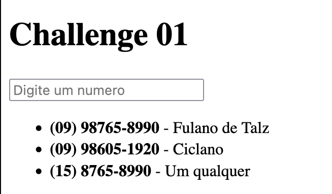

# Desafio 01

@here Pessoas linda, essa semana vamos ter nosso primeiro desafio de Front-end, no link de referência está um HTML de exemplo, mas você pode implementar em qualquer lib, framework, só se lembre das regras.

Na imagem, nós temos uma listagem telefônica, e um input. O desafio é quando o usuário digitar algo no input, a listagem será filtrada, mostrando apenas aqueles que contém o que foi digitado no input. Porém quando o usuário limpar o input você deverá mostrar todos os contatos.

Vamos avaliar nesse desafio principalmente otimização, e entendimento de como a DOM funciona.

Vamos lembrar os detalhes:
1. Eu vou passar um desafio de código, e na sexta-feira discutiremos as soluções de vocês.
2. Não tem solução errada, ou certa, vamos analisar todas e ver onde cada uma se encaixa.
3. Por enquanto vão ser uns desafios meio agnósticos de tecnologia/linguagem até que eu consiga organizar melhor.

Vamos as regras:
1. Se você for utilizar recursos de tecnologias, ou Libs tipo .sort(), você tem que saber o que o .sort() faz.
2. Pode fazer em qualquer linguagem.
3. Na sexta nós vamos discutir porquê uma solução pode ser melhor que outra, lembrando que não tem resposta certa, tem situação melhor.
4. Se vc solucionar, manda o código por aqui, de preferência em arquivo.
5. Se o desafio disser que o input será de tal forma, acredite que será de tal forma. (
